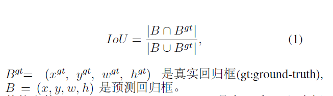
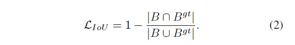
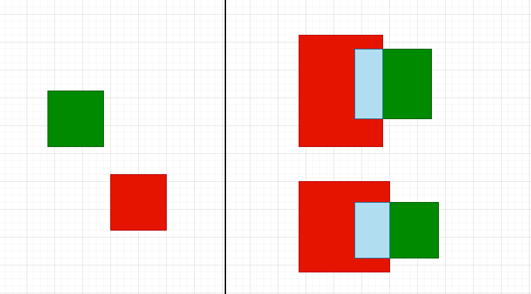
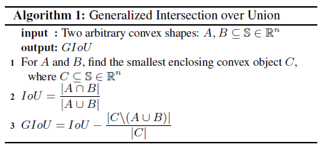
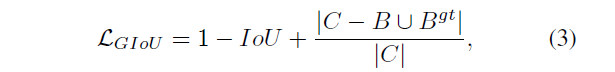
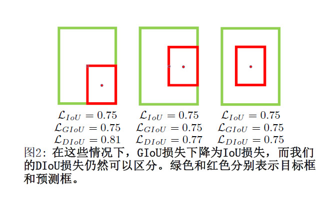
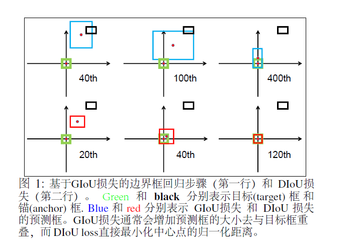
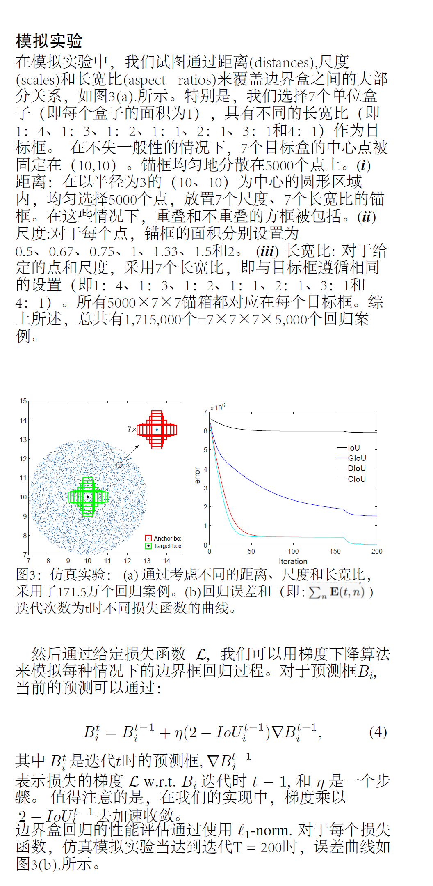
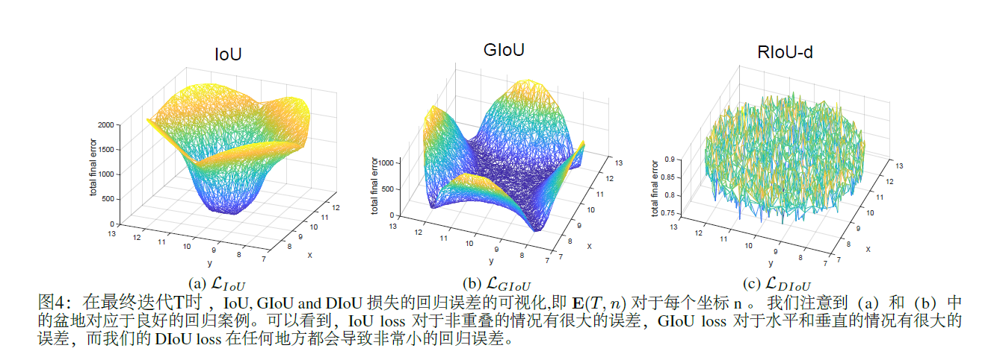
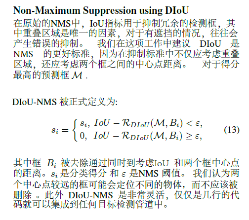

## 摘要
来源:https://github.com/Zzh-tju/DIoU/blob/master/README.md#introduction

**边界框回归是目标检测的关键步骤**，在现有方法中，虽然$\ell_n$-norm loss 被广泛用于边界框回归，它不是针对评估指标量身定制的，即 Intersection over Union (IoU)。最近，已经提出了 IoU 损失和generalized IoU (GIoU) 损失作为评估的IoU指标 ，但仍然存在收敛速度慢和回归不准确的问题。在本文中，我们通过结合预测框和目标框之间的归一化距离来提出距离-IoU (DIoU) 损失，它在训练中的收敛速度比 IoU 和 GIoU 损失快得多。

**此外，本文总结了边界框回归中的三个几何因素，即**

**重叠面积（overlap area）、中心点距离（central point
distance）和高宽比（aspect ratio）**，在此基础上提出了完全 IoU (CIoU) 损失，从而促进了更快的收敛和更优的性能。通过将 DIoU 和 CIoU 损失结合到最先进的目标检测算法中，例如 YOLO v3、SSD 和 Faster RCNN，我们不仅在 IoU 指标方面而且在 GIoU 指标方面都获得了显着的性能提升。此外，DIoU 可以很容易地用于非最大抑制（NMS）作为标准，进一步促进性能提升。 

**目标检测是计算机视觉任务中的关键问题之一**，几十
年来一直受到了广泛的研究关注 (Redmon et al. 2016;
Redmon and Farhadi 2018; Ren et al. 2015; He et al. 2017;
Yang et al. 2018; Wang et al. 2019; 2018). 
通常，现有的目标检测方法可以分为：
- 单阶段-检测，如YOLO系列
(Redmon et al. 2016; Red- mon and Farhadi 2017; 2018)
和SSD (Liu et al. 2016; Fu et al. 2017),
- 两阶段检测，如
R-CNN系列检测 (Girshick et al. 2014; Girshick 2015; Ren
et al. 2015; He et al. 2017), 
- 甚至是多阶段的检测, 像Cascade
R-CNN (Cai and Vasconcelos 2018). 尽管存在这些不
同的检测框架，但边界框回归预测一个矩形框来定位目
标对象仍然是其中关键步骤。
## 前言 
本文主要是结合论文[Distance-IoU Loss: Faster and Better Learning for Bounding Box Regression](https://arxiv.org/pdf/1911.08287.pdf) 进行对iou的解析学习。[翻译版](https://oneflow-static.oss-cn-beijing.aliyuncs.com/one-yolo/imgs/DIOU-%E7%BF%BB%E8%AF%91%E7%89%88.pdf)
## IOU
### IOU介绍
Intersection over Union (IoU) 

在指标评估概述的小节有介绍过IOU,已经对IOU有了初步的认识(其实在yolov5项目中并不是简单的使用，而是用的后面介绍的CIOU )   
计算公式：

 
 
 

### IOU loss 
定义：

 
 
 

### IOU 优缺点分析

有明显的缺陷 IoU loss只在边界框有重叠时才能工作, 对于不重
叠的情况不会提供任何移动梯度。( *即无法衡量完全不相交的两个框所产生的的损失（iou固定为0），和两个不同形状的预测框可能产生相同的loss（相同的iou）分别如下图的左边和右边所示。*)

 
 
 
IOU = 预测回归框与真实回归框的交集 / 预测回归框与真实回归框的并集

## GIOU 
### GIOU介绍
GIOU的设计初衷就是想解决IOU Loss存在的问题（预测框与真实框不相交时iou恒定为0），设计了一套Generalized Intersection over Union Loss。在IOU的基础上，GIOU还需要找到预测框和真实框的最小外接矩形，然后求出最小外接矩形减去两个预测框union的面积，具体算法流程如下：

其中 **|C\(AUB)|** 表示： *C的面积- (AUB的面积)。*

### GIOU loss 
定义 :

**其中 C  是覆盖 B  和 Bgt 的最小方框**,由于引入了C，在不重叠的情况下，预测框也会向目标框移动。

### GIOU 优缺点分析

GIOU Loss解决了IOU Loss在不相交情况的问题，在所有性能指标中都可以作为IoU的适当替代品，在目标检测任务中能够得到更高的准确率。 

缺点：虽然GIoU可以缓解重叠情况下的梯度消失问题,但它仍有一些局限性。
(*即无法衡量有包含关系时的框回归损失，如下图，三个回归框具有相同的GIOU Loss，但是显然第三个框的回归效果更好。*)

    
  
 <caption>

## IOU & GIOU 分析
首先，我们分析了其局限性关于原始的IoU损失和GIoU 损失。然而，很难仅仅从检测结果来分析边界框回归的过程，因为在不受控制的基准中的回归情况往往不全面例如，不同的距离(distances),不同的尺度(scales)和不同的长宽比(aspect ratios)。 相反，我们建议进行的模拟实验，其中需要综合考虑回归情况，然后就可以很容易地分析给定损失函数的问题。
### 模拟实验

    

    

### IoU 和 GIoU 损失的限制

    

在图4中，我们可视化迭代T时对5000个分散点的最终回归误差。

- 从图4(a)中很容易看出，IoU损失只适用于与目标框重叠的情况。由于∇B总是0，没有重叠的锚框将不会移动。通过添加一个惩罚项见公式(3),
-  GIoU 损失能够更好的缓解非重叠 案例的问题，如图所示4(b), 但GIoU的损失显著扩大了盆地，即GIoU的工作面积。但是，在水平方向和垂直方向的情况下，仍然很可能有很大的误差。这是因为GIoU损失中的惩罚项是用来最小化|C−A∪B|，但是C−A∪B的面积通常很小或为0（当两个盒子有包含关系时），然后GIoU几乎退化为IoU损失。GIoU的损失能收敛到很好的解决方案只要以适当的学习速率运行足够的迭代，但收敛速度确是非常慢。从几何上来说，从如图1所示的回归步骤来看，可以看出，GIoU实际上增大了预测的框大小，用去和目标框重叠，然后IoU项将使预测框与目标框匹配，产生非常缓慢的收敛。

**综上所述，在非重叠情况下，IoU损失收敛是糟糕的解决方式，而GIoU损失收敛速度较慢，特别是对于水平和垂直方向的框。当纳入目标检测管道时，IoU和GIoU的损失都不能保证回归的准确性。**

## DIOU & CIOU
通过前面的IOU和GIOU的分析我们很自然会问以下问题：
1. 第一，是否可以直接最小化预测框和目标框之间的归一化距离，以实现更快的收敛？
2. 第二，当与目标框有重叠甚至包含时，如何使回归
更准确、更快？

### DIOU loss
Distance-IoU 损失：边界框回归的更快更好的学习

    

 

   

    

### CIoU loss 

    

## NMS(Non-Maximum Suppression)
### 介绍 
NMS是大多数目标检测算法的最后一步，其中删除了冗余的检测框当它与最高分框的重叠超过一个阈值。 Soft-NMS (Bodla et al. 2017) 用连续函数w.r.t.惩罚相邻框的检测分数IoU，产生比原始NMS产生更柔和大和更强大的抑制。IoU-Net (Jiang et al. 2018) 提出了一个新的网络分支来预测定位置信度来指导NMS。最近，自适应NMS（Liu，Huang，和Wang 2019）和Softer-NMS（He et al. 2019）被提出分别研究适当的阈值策略和加权平均策略。 在本工作中，简单将DIoU作为原始NMS的标准, 在抑制冗余框时，同时考虑边界框的重叠面积和两个中心点之间的距离。
### DioU-NMS

    

## 小结
在本文中，主要的是即用于边界框回归的 DIoU损失和
CIoU 损失 和 用于抑制冗余检测框的DIoU-NMS。
通过直接最小化两个中心点的归一化的距离，
DIoU 损失可以比GIoU 损失实现更快的收敛。
此外CIoU损失考虑了三个几何属性，即
重叠区域、中心点距离 和 长宽比，促进了
更快的收敛和更优的性能。 其中提议的
损失和DIoU-NMS可以很容易地结合到任何目标检测管道中，并获得在基准上卓越的结果。

## 参考文章
- https://github.com/Zzh-tju/DIoU/blob/master/README.md#introduction
- IOU: https://arxiv.org/pdf/1608.01471.pdf
- GIOU: https://giou.stanford.edu/GIoU.pdf
- DIOU: https://arxiv.org/pdf/1911.08287.pdf