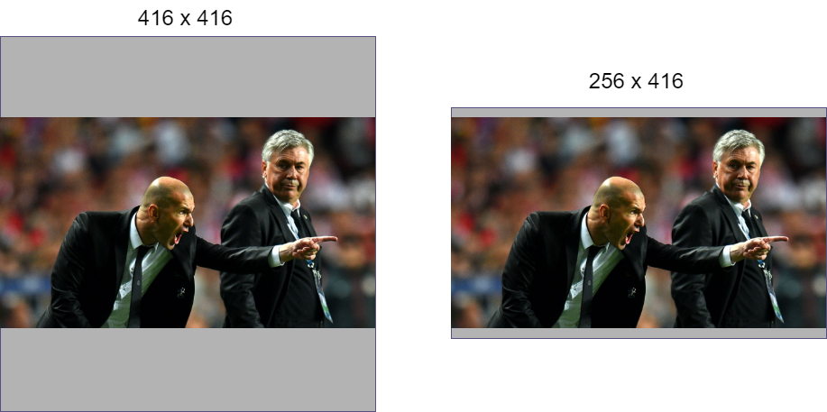

# 矩形推理
## 介绍
当我们把一幅图片送入网络，这幅图的宽度和高度与网络需求的不一致的时候，我们肯定需要对图片做出一些改变。

一般来说有两种常用的选择:(假设 网络需求的图片大小为32的倍数,传入的图片高宽为 200 x 416 )
1. 正方形推理(square lnference)
是将图片填充为正方形,如下图左边所示。
2. 矩形推理(Rectangular Inference)
如下图右边所示。



分析: 可以看到上图正方形推理存在大量的冗余部分,而右边的矩形推理明显冗余部分少于左边并且实际表现的相比正方形推理能显著的减少推理时间。

推理过程：将较长边设定为目标尺寸 416,512… (必须是32的倍数)，短边按比例缩放，再对短边进行较少填充使短边满足32的倍数，详细过程详见源码解析。
## 拓展
###  矩形推理源码解析
对应仓库文件:

https://github.com/Oneflow-Inc/one-yolov5/blob/add_document/utils/augmentations.py#L93-L131

```python

# 图片缩放：保持图片的宽高比例，剩下的部分用灰色填充。
def letterbox(im, new_shape=(640, 640), color=(114, 114, 114), auto=True, scaleFill=False, scaleup=True, stride=32):
    """
    将图片缩放调整到指定大小
    @Param img: 原图 
    @Param new_shape: 缩放后的图片大小
    @Param color: pad的颜色
    @Param auto: True 保证缩放后的图片保持原图的比例 即 将原图最长边缩放到指定大小，再将原图较短边按原图比例缩放（不会失真）
                 False 将原图最长边缩放到指定大小，再将原图较短边按原图比例缩放,最后将较短边两边pad操作缩放到最长边大小（不会失真）
    @Param scale_fill: True 简单粗暴的将原图resize到指定的大小 相当于就是resize 没有pad操作（失真）
    @Param scale_up: True  对于小于new_shape的原图进行缩放,大于的不变
                     False 对于大于new_shape的原图进行缩放,小于的不变
    @return: img: letterbox后的图片 
             ratio: wh ratios 
             (dw, dh): w和h的pad
    """
    # Resize and pad image while meeting stride-multiple constraints
    # 取图片的高宽
    shape = im.shape[:2]  # current shape [height, width]

    if isinstance(new_shape, int):
        new_shape = (new_shape, new_shape)

    # Scale ratio (new / old) 计算缩放因子
    r = min(new_shape[0] / shape[0], new_shape[1] / shape[1])
    """
    缩放(resize)到输入大小img_size的时候,如果没有设置上采样的话,则只进行下采样 
    因为上采样图片会让图片模糊,对训练不友好且影响性能。
    """
    if not scaleup:  # only scale down, do not scale up (for better val mAP)
        r = min(r, 1.0)

    # Compute padding 计算填充
    ratio = r, r  # width, height ratios
    # 新的未填充大小, 保证缩放后图像比例不变
    new_unpad = int(round(shape[1] * r)), int(round(shape[0] * r))
    dw, dh = new_shape[1] - new_unpad[0], new_shape[0] - new_unpad[1]  # wh padding
    if auto:  # minimum rectangle 获取最小矩形填充
        # 这里的取余操作可以保证padding后的图片是32的整数倍(416x416)，如果是(512x512)可以保证是64的整数倍
        dw, dh = np.mod(dw, stride), np.mod(dh, stride)  # wh padding
    # 如果scaleFill = True,则不进行填充，直接resize成img_size,任由图片进行拉伸和压缩
    elif scaleFill:  # stretch
        dw, dh = 0.0, 0.0
        new_unpad = (new_shape[1], new_shape[0])
        ratio = new_shape[1] / shape[1], new_shape[0] / shape[0]  # width, height ratios
    # 计算上下左右到填充,即将padding分到上下，左右两侧
    dw /= 2  # divide padding into 2 sides
    dh /= 2
    # 将原图resize到new_unpad 
    if shape[::-1] != new_unpad:  # resize
        im = cv2.resize(im, new_unpad, interpolation=cv2.INTER_LINEAR)
    # 下面两行计算需要填充 padding
    top, bottom = int(round(dh - 0.1)), int(round(dh + 0.1)) # 计算上下两侧的padding
    left, right = int(round(dw - 0.1)), int(round(dw + 0.1)) # 计算左右两侧的padding
    # 调用cv2.copyMakeBorder函数进行背景填充。
    im = cv2.copyMakeBorder(im, top, bottom, left, right, cv2.BORDER_CONSTANT, value=color)  # add border
    return im, ratio, (dw, dh)
```


